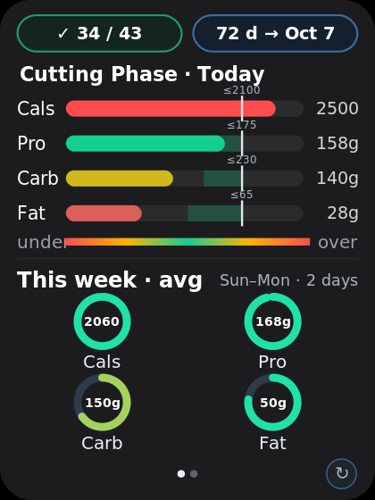
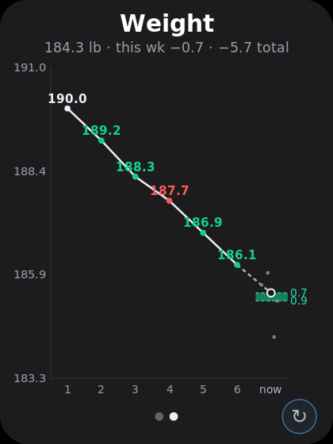

# Macro Widget (Android)

A home-screen widget for running a **constant-deficit cut** with almost zero interaction.
You log food and weigh-ins through a Google Form; a **Google Sheet + Apps Script** do all
the computation; the widget is a glanceable, read-only dashboard that renders the result in
one tile. Nothing is entered on the phone — you just look at it.

## What it is

The core idea is a clean split of responsibilities:

- **The Sheet is the source of truth and the compute engine.** Apps Script ingests your Form
  submissions, builds a tidy per-day `Summary`, back-calculates your real TDEE from measured
  intake and weight trend, and writes each day's macro targets.
- **The widget is a dumb, fast dashboard.** It fetches two published CSVs, draws them, and
  caches aggressively so it never blinks or shows an error if the network hiccups. It performs
  no meaningful math of its own beyond layout and grading.

The tile has **three pages** — Today, Burn rate (Energy), and Weight — that you move between
by tapping the left or right half of the tile. A small **↻ button** in the bottom-right corner
refreshes.

## How it evolved

The project grew in layers, each committed as it stabilized:

1. **Static macro dashboard.** Today's Calories/Protein/Carbs/Fat graded against fixed target
   bands, a green-day streak, and a weekly average.
2. **Weight view.** A weekly-average weight trend judged against an acceptable loss-rate band.
3. **Frozen green days.** Targets became *dated* (`EffectiveFrom`), so changing a band no longer
   retroactively re-scores past days — history is judged against the target that was in effect
   *then*.
4. **Energy / TDEE model.** A third page that empirically back-calculates TDEE from intake and
   the weight-loss slope, and shows your measured rate against the goal band.
5. **Dynamic constant-deficit targets.** Instead of a fixed calorie band, the Sheet computes a
   daily target that holds a steady deficit: `anchor = TDEE + workout_delta − deficit`, floored.
   Protein and fat stay fixed; **carbs are the daily plug** that slides. Calories is a computed
   anchor, never a pass/fail metric.
6. **Watch ingestion.** Pixel Watch → Health Connect → Google Form → Sheet, adding measured
   BMR and active-exercise burn so the daily target can flex with how hard you actually trained.

## Intent

Make a sustainable cut self-correcting. You don't guess maintenance or hand-tune macros — the
system measures your true expenditure from your own data and adjusts the daily target to keep
you in the goal loss-rate band, while never punishing past effort when the plan changes.

## Screens

<table>
  <tr>
    <td align="center"></td>
    <td align="center"></td>
    <td align="center"></td>
  </tr>
  <tr>
    <td align="center"><b>Page 1 · Today</b><br>streak + countdown, graded macro rows, weekly rings</td>
    <td align="center"><b>Page 2 · Burn rate</b><br>measured TDEE, loss rate vs band, intake nudge</td>
    <td align="center"><b>Page 3 · Weight</b><br>weekly-average trend, target band, weigh-ins</td>
  </tr>
</table>

> Representative renders from the widget's own drawing code (vector sources in `docs/*.svg`).

### Page 1 · Today
Graded bullet rows for Calories, Protein, Carbs, Fat vs. the day's target band. When per-day
targets exist (Sheet `Summary` cols I–L) each row uses that day's computed center ± the config
band width; otherwise it falls back to the static `Targets` band. Each bar marks its upper bound
(`≤`) and shows a faint "to go" hint below the midpoint (informational only). A streak chip and
a day-countdown to the goal date sit on top; a weekly-average ring cluster sits below.

### Page 2 · Burn rate (Energy)
Your empirically measured **TDEE** (hero), the number of weigh-ins it's based on, and your
average intake over the window. Below that, the **measured loss rate** colored against the
0.7–0.9 lb/wk goal band (green in-zone, amber cutting too hard, red under-cutting), a gauge with
a marker, and an action line telling you how to adjust intake to settle into the band
(e.g. `Eat +250 kcal/day → 0.8 lb/wk`). Until there's enough data it shows a "measuring" state.

### Page 3 · Weight
A weekly-average weight trend. Daily weigh-ins (`Summary` col F) show as a faint cluster on the
current week and consolidate into one weekly point at week's end (Sun→Sat). Week-over-week loss
is judged against the rate band (the `Targets` "Weight Loss" row): in-band weeks get a ✓,
out-of-band show amber. A green band anchored at last week's average − 0.7 to − 0.9 marks where
the current week should land.

Color throughout is **graded**, not snapped: inside the band = green, easing to amber then red
as you drift. Being *under* on fat is treated as danger; under on cals/carbs/protein is amber.

## How the numbers work

### TDEE (measured, not assumed)
`TDEE ≈ avg intake − weight_slope(lb/day) × 3500`, where the slope is a least-squares regression
over the trailing window's weigh-ins (currently **20 days**, ending yesterday — today's partial
intake is excluded). Regression over the raw daily points smooths water/glycogen noise without
hinging on two endpoints. It only shows a number once past the data bar: **≥ 8 weigh-ins,
≥ 10 logged-intake days, and a ≥ 14-day span** within the window; otherwise it reports how many
more days are needed.

### Dynamic constant-deficit targets
Computed in the Sheet (`Code.gs`) and written to `Summary` I–L:
`anchor = max(TDEE + (today's burn − typical burn) − deficit, floor)`, then
`carb_center = (anchor − 4·protein_center − 9·fat_center) / 4`. Protein/fat centers come from
their fixed bands; carbs absorb the flex; `t_cal` is the anchor (display only). Missing watch
data → no workout delta (falls back cleanly). `Floor` and `Deficit` are read from the `Targets`
tab as dated config.

### Frozen green days
A day counts as successful when **Protein, Carbs and Fat all land in band** (Calories are
intentionally not gated). Each day is scored against the target in effect *on that date* via
`TargetHistory`/`EffectiveFrom`, so editing or dating a new target never re-scores earlier days.
The tally is recomputed from the Sheet each refresh, so it self-corrects and never drifts.

### Watch burn ingestion
`HealthConnectBurnReader` reads the day's active-exercise calories (aggregate, with record-sum
and Total−BMR fallbacks) and latest BMR. `BurnUploadWorker` posts `{basal, burn, date}` to the
existing Google Form (single-day, plus a one-time 30-day backfill). Health Connect retains
~30 days; older days are hand-entered via a back-dated Form payload. See `SETUP-burn-ingestion.md`.

### No-blink refresh, offline, retries
Each refresh paints the last rendered frame instantly (cached to disk) before the fetch runs, so
the tile never drops to an empty card. Fetches use conditional GET (ETag / `If-Modified-Since`)
so an unchanged sheet returns `304` and the cached body is reused; if a fetch fails, the last
good CSVs are re-rendered rather than showing an error. Work is de-duplicated and throttled.

## Setup

### 1. Sheet + Form
The daily pipeline runs off a Google Form feeding a Sheet; `Code.gs` builds these tabs. The
widget reads two published CSVs:

**Summary** (built by Apps Script; columns by position):
```
date, cal, p, c, f, weight, basal, burn, t_cal, t_pro, t_carb, t_fat
```

**Targets** (rows matched by keyword, so order is flexible; `EffectiveFrom` is optional):
```
Macro,        Lower, Upper, UnderSeverity, EffectiveFrom
Calories,     1625,  1750,  mild
Protein,      145,   158,   mild
Carbs,        160,   170,   mild
Fat,          45,    50,    danger
Weight Loss,  0.7,   0.9,   mild
Floor,        1625,                          (only Lower is read — anti-starve calorie floor)
Deficit,      425,                           (only Lower is read — kcal/day deficit to hold)
```

`Floor` and `Deficit` are required for the dynamic targets to compute; without them the widget
falls back to the static bands. To switch the dynamic system on at a chosen date, set that date
as `EffectiveFrom` on the `Floor` and `Deficit` rows — earlier days stay on the static bands.

Publish each tab: **File → Share → Publish to web → that tab → CSV → Publish**, and copy each
link (`.../pub?gid=...&single=true&output=csv`).

### 2. Apps Script
Paste `backend/Code.gs` into the Sheet's Apps Script editor. Add the `Floor`/`Deficit` rows,
run `updateTargetsToday` once, and create the daily trigger (`createTargetsTrigger`, ~14:30) so
each new day gets its targets written. (Optional watch backfill: `runBackfill`.)

### 3. Build + add the widget
1. Open the folder in **Android Studio** (Hedgehog or newer); let Gradle sync; run on device.
2. Long-press home → **Widgets** → **Macro Widget** → drag on a tile.
3. Paste the **Summary URL** and **Targets URL** → **Save** (remembered for next time).
4. To feed watch data, tap **Grant Watch / Health Connect Access** in setup and approve the
   Health Connect permissions.

### 4. Use
Tap the **left/right halves** to change page; tap the **↻ corner** to refresh. The tile also
auto-refreshes about every 30 min (Android's floor, only while awake).

## Where things live

- `CsvParser.kt` — parses `Summary` (by position, incl. weight/burn and per-day targets I–L) and `Targets` (by keyword, incl. dated bands + `Floor`/`Deficit`).
- `MacroModel.kt` — `LogEntry`, `MacroType`, `Target`, `DatedTarget`, `TargetHistory` (frozen greens), `WeightTarget`.
- `MacroCalculator.kt` — today's row, weekly average, successful-day tally, `effectiveTargets` (per-day center ± width, static fallback).
- `TdeeCalculator.kt` — back-calculated TDEE + loss rate over the trailing window; readiness gate.
- `DynamicTargetCalculator.kt` — app-side dynamic-target reference implementation (production compute lives in `Code.gs`).
- `WeightCalculator.kt` — weekly-average weight, week-over-week rate, in-zone, current-week band.
- `ColorRamp.kt` — graded palettes and the zone-color function.
- `ChartRenderer.kt` / `EnergyRenderer.kt` / `WeightRenderer.kt` — the three page bitmaps.
- `WidgetChrome.kt` — shared footer (refresh button; page dots removed in favor of tap halves).
- `HealthConnectBurnReader.kt` — reads active calories + BMR from Health Connect.
- `BurnUploadWorker.kt` — posts burn to the Form; single-day + 30-day backfill.
- `ChartWorker.kt` — fetches both CSVs off-thread, computes streak/countdown/TDEE, 3-way page dispatch, pushes the bitmap. Holds `GOAL_DATE` / `GOAL_LABEL`.
- `SheetFetcher.kt` / `SheetCache.kt` / `BitmapCache.kt` — fetch with retry + conditional GET, per-URL CSV cache, and last-frame cache (no-blink).
- `SheetWidgetProvider.kt` — update/resize/tap handling (prev/next page + refresh), cached-frame painting, work de-dup + throttle.
- `WidgetConfigActivity.kt` — the two-URL setup screen + Health Connect grant flow.
- `backend/Code.gs` — the Sheet-side engine: Form ingestion, `Summary` build, TDEE + dynamic-target compute, dated config.

## Docs
- `SPEC-frozen-green-days.md` — the dated-target scoring rule.
- `SETUP-burn-ingestion.md` — watch → Health Connect → Form deploy, backfill, and manual entry.
- `macro_app_upgrade_roadmap.md` — design history and what's next.

## Note
The pure data logic (CSV parsing, date/week handling, TDEE, dynamic targets, weight/zone grading)
and `Code.gs` were unit-/syntax-verified on the JVM and Node. The Android UI layer needs a normal
Android Studio build — there's no embedded Android SDK in the authoring environment.
