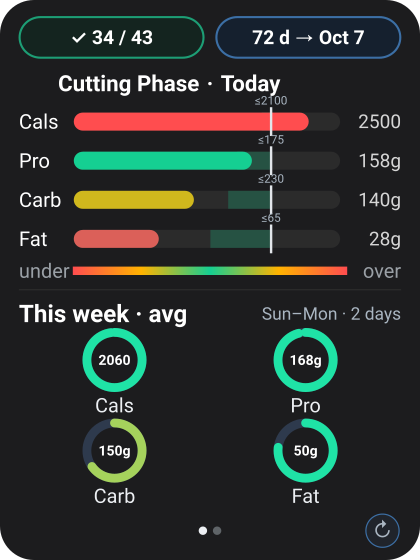
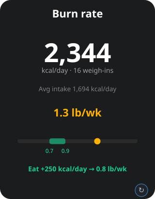
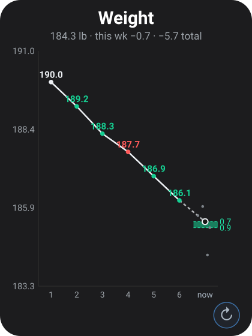
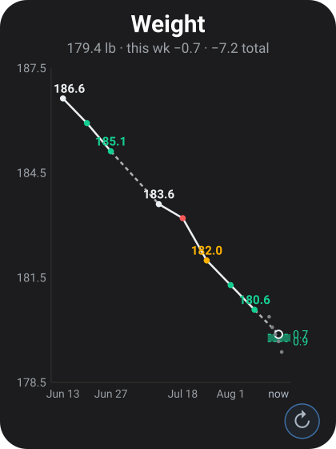

# Macro Widget (Android)

A home-screen widget for running a **constant-deficit cut** with almost zero interaction.
You log food and weigh-ins through a Google Form; a **Google Sheet + Apps Script** do all
the computation; the widget is a glanceable, read-only dashboard that renders the result in
one tile. Nothing is entered on the phone — you just look at it.

## What it is

The core idea is a clean split of responsibilities:

- **The Sheet is the source of truth and the compute engine.** Apps Script ingests your Form
  submissions, builds a tidy per-day `Summary`, back-calculates your real TDEE from measured
  intake and weight trend, and writes each day's macro targets.
- **The widget is a dumb, fast dashboard.** It fetches two published CSVs, draws them, and
  caches aggressively so it never blinks or shows an error if the network hiccups. It performs
  no meaningful math of its own beyond layout and grading.

The tile has **three pages** — Today, Burn rate (Energy), and Weight — that you move between
by tapping the left or right half of the tile. A small **↻ button** in the bottom-right corner
refreshes.

## How it evolved

The project grew in layers, each committed as it stabilized:

1. **Static macro dashboard.** Today's Calories/Protein/Carbs/Fat graded against fixed target
   bands, a green-day streak, and a weekly average.
2. **Weight view.** A weekly-average weight trend judged against an acceptable loss-rate band.
3. **Frozen green days.** Targets became *dated* (`EffectiveFrom`), so changing a band no longer
   retroactively re-scores past days — history is judged against the target that was in effect
   *then*.
4. **Energy / TDEE model.** A third page that empirically back-calculates TDEE from intake and
   the weight-loss slope, and shows your measured rate against the goal band.
5. **Dynamic constant-deficit targets.** Instead of a fixed calorie band, the Sheet computes a
   daily target that holds a steady deficit: `anchor = TDEE + workout_delta − deficit`, floored.
   Protein and fat stay fixed; **carbs are the daily plug** that slides. Calories is a computed
   anchor, never a pass/fail metric.
6. **Training-burn flex.** The day's strength-training calories go in through the same Google
   Form, so the daily target can flex with how hard you actually trained. (Originally a Pixel Watch
   → Health Connect automation; it never worked reliably and was removed — the burn number is
   hand-entered.) **This flex is currently switched off** (`BURN_DELTA_ENABLED = false`); the
   training is already inside the measured TDEE, so the delta is held at 0. See ASSUMPTIONS.md §24.
7. **A weight page that survives a long cut.** The trend originally plotted every week ever
   logged, so it degraded as it filled up — by six months the weekly points were closer together
   than their own diameter and the target band was thinner than a hairline. The page now sizes
   itself off a recent window instead of total history, and weeks come from the calendar rather
   than from the rows that exist, so a week you didn't weigh in stays visible as a gap instead of
   silently closing up and corrupting the next week's loss rate.

## Intent

Make a sustainable cut self-correcting. You don't guess maintenance or hand-tune macros — the
system measures your true expenditure from your own data and adjusts the daily target to keep
you in the goal loss-rate band, while never punishing past effort when the plan changes.

## Screens

<table>
  <tr>
    <td align="center"></td>
    <td align="center"></td>
    <td align="center"></td>
  </tr>
  <tr>
    <td align="center"><b>Page 1 · Today</b><br>streak + countdown, graded macro rows, weekly rings</td>
    <td align="center"><b>Page 2 · Burn rate</b><br>measured TDEE, loss rate vs band, intake nudge</td>
    <td align="center"><b>Page 3 · Weight</b><br>recent weekly-average trend, target band, this week's weigh-ins by day</td>
  </tr>
</table>

> Representative renders from the widget's own drawing code (vector sources in `docs/*.svg`).

### Page 1 · Today
Graded bullet rows for Calories, Protein, Carbs, Fat vs. the day's target band. When per-day
targets exist (Sheet `Summary` cols I–L) each row uses that day's computed center ± the config
band width; otherwise it falls back to the static `Targets` band. Each bar marks its upper bound
(`≤`) and shows a faint "to go" hint below the midpoint (informational only). A streak chip and
a day-countdown to the goal date sit on top; a weekly-average ring cluster sits below — each ring
grades the week's average against the **mean of that macro's per-day band across the week**, so a
single low-ceiling day (e.g. a deep-deficit Saturday) doesn't skew the week's color.

### Page 2 · Burn rate (Energy)
Your empirically measured **TDEE** (hero), the number of weigh-ins it's based on, and your
average intake over the window. Below that, the **measured loss rate** colored against the
0.7–0.9 lb/wk goal band (green in-zone, amber cutting too hard, red under-cutting), a gauge with
a marker, and an action line telling you how to adjust intake to settle into the band
(e.g. `Eat +250 kcal/day → 0.8 lb/wk`). Until there's enough data it shows a "measuring" state.

### Page 3 · Weight
A weekly-average weight trend (week = Sun→Sat). The current week's daily weigh-ins (`Summary`
col F) sit on their **own day-of-week columns**, Sun→Sat within the current week's slot, and
consolidate into one weekly point — so you can see whether the week trended down or bounced,
not just where it ended up. The current week finalizes — becoming a solid, labeled point — as
soon as **its Saturday weigh-in is logged**, rather than waiting for the calendar to roll past
Saturday. Week-over-week loss is judged against the rate band (the `Targets` "Weight Loss" row)
and colors that week's dot: **green** in-band, **amber** losing faster than the band, **red**
losing slower, neutral when there's no rate to judge. A green band anchored at last week's
average − 0.7 to − 0.9 marks where the current week should land.

**It plots a recent window, not all of history.** Everything on the page is sized off the last
6–14 weeks (10 on a typical tile), picked so a week's slot stays wide enough for its seven
day-of-week positions; whole-history figures live in the subline instead. The y axis is capped at
whatever span still renders the 0.2 lb target band 8 px tall, and if the window won't fit under
that cap the *window* shortens rather than the trend clipping. Value labels are packed
newest-first and dropped as soon as one would touch its neighbour, and the x axis shows
week-ending dates instead of an ever-growing week number. Without this the page decayed as it
filled: at 26 weeks the slots were 11 px wide against a 7.6 px dot, the band was 3 px tall, and
the value labels had been overlapping since week 8.

**A missed week stays visible.** Weeks are enumerated from the calendar, not from the rows that
happen to exist, so a week with no weigh-ins keeps its slot: nothing is drawn in it, it gets no
date label, and the trend is carried across it by a **dashed** line. A solid segment therefore
always means one real week to the next. The week *after* a gap is left neutral rather than
colored, because its loss would be a two-week delta wearing a weekly label — and for the same
reason the current week gets no target band when the week before it was missed.

<p align="center">
  
</p>

> The same page with a missed week mid-chart. Its slot is held open, the trend is dashed across
> it, and the following week is neutral. This render also shows every dot state at once: neutral
> (first week, and the week after the gap), green in-band, red under-cut, amber over-cut.

Color throughout is **graded**, not snapped: inside the band = green, easing to amber then red
as you drift. Being *under* on fat is treated as danger; under on cals/carbs/protein is amber.

## How the numbers work

### TDEE (measured, not assumed)
`TDEE ≈ avg intake − weight_slope(lb/day) × 3500`, where the slope is a least-squares regression
over the trailing window's weigh-ins (**28 days**, ending yesterday — today's partial intake is
excluded). 28 rather than 20: in a 20-day fit the four edge weigh-ins carry ~58% of the slope, so a
single water-low reading at the window edge could swing TDEE by hundreds of kcal (ASSUMPTIONS.md §8).
Regression over the raw daily points smooths water/glycogen noise without hinging on two endpoints. It only shows a number once past the data bar: **≥ 8 weigh-ins,
≥ 10 logged-intake days, and a ≥ 14-day span** within the window; otherwise it reports how many
more days are needed.

### Dynamic constant-deficit targets
Computed in the Sheet (`Code.gs`) and written to `Summary` I–L:
`anchor = max(TDEE + (today's burn − typical burn) − deficit, floor)`, then
`carb_center = (anchor − 4·protein_center − 9·fat_center) / 4`. Protein/fat centers come from
their fixed bands; carbs absorb the flex; `t_cal` is the anchor (display only). The workout-burn
term `(today's burn − typical burn)` is **currently forced to 0** — the training-burn flex is off
(`BURN_DELTA_ENABLED = false`, see below and ASSUMPTIONS.md §24) — so in practice
`anchor = max(TDEE − deficit, floor)`. `Floor` and `Deficit` are read from the `Targets` tab as
dated config.

### Frozen green days
A day counts as successful when **Protein, Carbs and Fat all land in band** (Calories are
intentionally not gated). Each day is scored against the target in effect *on that date* via
`TargetHistory`/`EffectiveFrom`, so editing or dating a new target never re-scores earlier days.
The tally is recomputed from the Sheet each refresh, so it self-corrects and never drifts.

### Training burn (currently OFF)
The training-burn flex is switched off end to end (`BURN_DELTA_ENABLED = false`): burn payloads are
not ingested, existing burn values are not read, and `Summary` col H is written blank, so the
workout delta contributes nothing to the daily target. It's off because the historical figures were
watch "active calories" for resistance work (~2× a realistic net cost), and that training is already
captured inside the measured TDEE — so nothing is lost by ignoring it (ASSUMPTIONS.md §24).

The same flag picks the daily targets-trigger time via **`createTargetsTrigger`**: **off → ~03:00**
(TDEE window ends yesterday; no same-day input to wait for), **on → ~14:30** (afternoon so same-day
training can land). Flip the flag, then re-run `createTargetsTrigger()` once to move the live
schedule.

To re-enable, set `BURN_DELTA_ENABLED = true`, then run `rebuildTrackerFromResponses` (restores the
burn rows), `rebuildAllSummary`, and `createTargetsTrigger` once. When on: burn is submitted as
`{"burn": 320}` through the Form (add `"date": "DD/MM/YYYY"` to back-date); multiple entries for one
date are **summed**; a day with nothing logged is a **rest day worth 0** so the delta averages to
zero across the window; and submitting burn re-runs that day's target immediately, so training logged
after the afternoon trigger still lands.

There is no phone or watch integration: nothing in the app reads health data. Basal/BMR is not
collected and is not needed — the TDEE regression measures total expenditure from intake and the
weight trend, so a separate BMR figure would be redundant. `Summary` col G is a permanently blank
slot kept only so the per-day target columns (I–L) don't shift position.

### No-blink refresh, offline, retries
Each refresh paints the last rendered frame instantly (cached to disk) before the fetch runs, so
the tile never drops to an empty card. Fetches use conditional GET (ETag / `If-Modified-Since`)
so an unchanged sheet returns `304` and the cached body is reused; if a fetch fails, the last
good CSVs are re-rendered rather than showing an error. Work is de-duplicated and throttled.

## Setup

### 1. Sheet + Form
The daily pipeline runs off a Google Form feeding a Sheet; `Code.gs` builds these tabs. The
widget reads two published CSVs:

**Summary** (built by Apps Script; columns by position):
```
date, cal, p, c, f, weight, unused, burn, t_cal, t_pro, t_carb, t_fat
```
(`unused`/col G is always blank — a fixed slot so the target columns `t_cal`–`t_fat` don't shift.)

**Targets** (rows matched by keyword, so order is flexible; `EffectiveFrom` is optional):
```
Macro,        Lower, Upper, UnderSeverity, EffectiveFrom
Calories,     1625,  1750,  mild
Protein,      145,   158,   mild
Carbs,        160,   170,   mild
Fat,          45,    50,    danger
Weight Loss,  0.7,   0.9,   mild
Floor,        1625,                          (only Lower is read — anti-starve calorie floor)
Deficit,      425,                           (only Lower is read — kcal/day deficit to hold)
```

`Floor` and `Deficit` are required for the dynamic targets to compute; without them `Code.gs` writes
no per-day targets and the widget falls back to the static bands. To switch the dynamic system on at a chosen date, set that date
as `EffectiveFrom` on the `Floor` and `Deficit` rows — earlier days stay on the static bands.

Publish each tab: **File → Share → Publish to web → that tab → CSV → Publish**, and copy each
link (`.../pub?gid=...&single=true&output=csv`).

### 2. Apps Script + the logging Form
Paste `backend/Code.gs` into the Sheet's Apps Script editor. Then, from the editor:

1. Run **`createLoggingForm()`** once. It creates the **"Macro Log"** Form (a single `payload`
   question), links its responses to this spreadsheet (the `Form responses 1` tab), and installs the
   on-submit trigger to `processMacroPayload`. The execution log prints the Form's fill-in and edit
   URLs. (First run prompts for authorization.)
2. Add the `Floor`/`Deficit` rows to `Targets`, then run **`updateTargetsToday`** once.
3. Create the daily targets trigger (**`createTargetsTrigger`**). Schedule follows
   `BURN_DELTA_ENABLED`: **~03:00** while burn flex is off (current), **~14:30** when it is on.
   Re-run after flipping the flag. Optionally also run **`createNightlyRebuildTrigger`** (~00:45)
   to rebuild `Tracker`+`Summary` from the raw form responses each night.

**Logging payload.** Each submission is one **JSON** value in the `payload` question — a single object
or an array of objects:

```json
{"cal": 600, "p": 40, "c": 55, "f": 18, "meal": "Lunch", "details": "chicken & rice"}   // a meal
{"weight": 152.4}                                                                        // a weigh-in
[{"cal": 220, "p": 8, "c": 30, "f": 9, "meal": "Snack"}, {"weight": 152.4}]              // several at once
```

`cal`/`p`/`c`/`f` make a meal; `weight` makes a weigh-in; `meal`/`details` are optional labels; add
`"date":"DD/MM/YYYY"` to back-date. `burn` is accepted only if the training-burn flex is re-enabled
(off by default). Unknown or empty items are ignored. (The payload is plain JSON, so you can type it,
keep snippets handy, or have an assistant turn "180 g tofu, 1 cup rice" into the object for you.)

**Prefer to wire the Form by hand?** Create a Form with one **Paragraph** question titled `payload`;
**Responses → Link to Sheets →** this spreadsheet; then **Triggers → Add Trigger →**
`processMacroPayload`, event source **From spreadsheet**, type **On form submit**.

> The responses tab must be named `Form responses 1` (the `RESPONSES_TAB` constant); rename the tab or
> the constant if your locale names it differently. Keep the single `payload` question and don't enable
> "collect email" — the parser reads the payload from the second response column.

### 3. Build + add the widget
0. (Optional) Set your goal date, label, phase, and green-day start in **`config.properties`** at the
   repo root — these bake into the app via `BuildConfig`. If the file is missing, neutral defaults are used.
1. Open the folder in **Android Studio** (Hedgehog or newer); let Gradle sync; run on device.
2. Long-press home → **Widgets** → **Macro Widget** → drag on a tile.
3. Paste the **Summary URL** and **Targets URL** → **Save** (remembered for next time).

### 4. Use
Tap the **left/right halves** to change page; tap the **↻ corner** to refresh. The tile also
auto-refreshes about every 30 min (Android's floor, only while awake).

## Where things live

- `CsvParser.kt` — parses `Summary` (by position, incl. weight/burn and per-day targets I–L) and `Targets` (by keyword: dated macro bands + the `Weight Loss` row). It does **not** read `Floor`/`Deficit` — those are `Code.gs`-only.
- `MacroModel.kt` — `LogEntry`, `MacroType`, `Target`, `DatedTarget`, `TargetHistory` (frozen greens), `WeightTarget`.
- `MacroCalculator.kt` — today's row, weekly average (incl. the week's mean per-day band used to color the rings), successful-day tally, `effectiveTargets` (per-day center ± width, static fallback).
- `TdeeCalculator.kt` — back-calculated TDEE + loss rate over the trailing window; readiness gate.
- `WeightCalculator.kt` — weekly-average weight, week-over-week rate, in-zone, current-week band. Weeks are enumerated from the **calendar**, so a week with no weigh-ins survives as a gap (`avg = null`) instead of vanishing; `rate` is only set when the immediately preceding calendar week has data.
- `ColorRamp.kt` — graded palettes and the zone-color function.
- `ChartRenderer.kt` / `EnergyRenderer.kt` / `WeightRenderer.kt` — the three page bitmaps. `WeightRenderer` sizes its window and y span off recent weeks only, so nothing in its layout scales with total history.
- `WidgetChrome.kt` — shared footer (refresh button; page dots removed in favor of tap halves).
- `ChartWorker.kt` — fetches both CSVs off-thread, computes streak/countdown/TDEE, 3-way page dispatch, pushes the bitmap. Holds `GOAL_DATE` / `GOAL_LABEL`.
- `SheetFetcher.kt` / `SheetCache.kt` / `BitmapCache.kt` — fetch with retry + conditional GET, per-URL CSV cache, and last-frame cache (no-blink).
- `SheetWidgetProvider.kt` — update/resize/tap handling (prev/next page + refresh), cached-frame painting, work de-dup + throttle.
- `WidgetConfigActivity.kt` — the two-URL setup screen.
- `backend/Code.gs` — the Sheet-side engine: Form ingestion, `Summary` build, TDEE + dynamic-target compute, dated config.

## Docs
- `ASSUMPTIONS.md` — every tuning decision, why it exists, what it costs, and how to check it.
- `CONFIG-PROPOSAL.md` — proposed `Config` sheet for making the dials configurable (design note; not yet built).
- `backend/test/README.md` — how to run the offline test rig.

## License
MIT — see [`LICENSE`](LICENSE). Personal figures in the docs are illustrative example data, not real measurements.

## Note
The pure data logic (CSV parsing, date/week handling, TDEE, dynamic targets, weight/zone grading)
and `Code.gs` were unit-/syntax-verified on the JVM and Node. The Android UI layer needs a normal
Android Studio build — there's no embedded Android SDK in the authoring environment.
